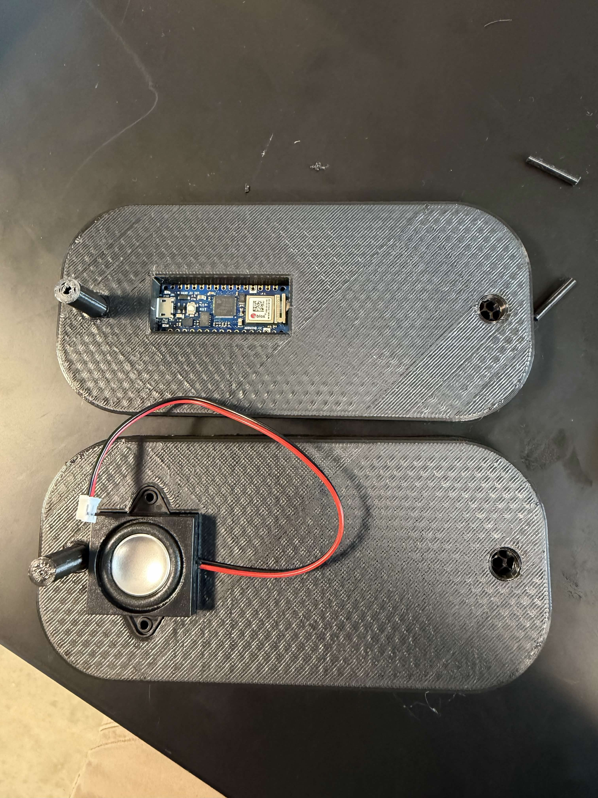

# EMG-Based ASL Recognition

**Forked from [EMG-ASL-TRANSLATOR-Triton-NeuroTech/core](https://github.com/EMG-ASL-TRANSLATOR-Triton-NeuroTech/core)**
Built as part of Triton NeuroTech at UC San Diego. See **My Contributions** below for specifics.

Built a machine learning system to classify ASL hand gestures from EMG (electromyography) signals using feature engineering and supervised learning, achieving **~96.67% test accuracy** on 8 gesture classes.

---

## Hardware

The project uses a custom 3D-printed wearable housing an Arduino Nano 33 BLE Sense with 8-channel EMG signal acquisition and an integrated speaker for real-time audio output.

---

## My Contributions

This fork extends the original codebase with the following work:

**1. Random Forest Classifier - Fine-Tuning and Optimization (RandomForest/)**
- Redesigned the full training pipeline in emg_classifyier.py: windowed feature extraction, GridSearchCV hyperparameter tuning, evaluation
- Achieved **96.67% test accuracy** on 327,092 rows across 8 gesture classes
- Confusion matrix shows near-perfect separation on most classes; see RandomForest/ for latest run output

**2. Preprocessing Pipeline - Adaptable to Model Requirements (RandomForest/prepare_emg_datasets.py)**
- Wrote prepare_emg_datasets.py to format raw EMG CSV files from CSV-Files/ (including nested per-gesture subfolders) into model-ready datasets
- Output: DATASET EMG MINDROVE/FORMATTED/subjek_FORMATTED.csv and by_gesture/*.csv
- Designed to be re-runnable as new gesture recordings are added

**3. UMAP Feature Analysis**
- Added test_folder and compare_gesture commands to run_umap.py for gesture-level consistency checks and cross-gesture separability analysis
- Documented methodology in ENHANCEMENT_SUMMARY.md and GESTURE_ANALYSIS_GUIDE.md

---

## Gesture Classes

| Label | Gesture |
|-------|---------|
| 1 | Closed Hand |
| 2 | Open Hand |
| 3 | Index Finger |
| 4 | Ring Finger |
| 5 | Pinky Finger |
| 6 | Spider-Man |
| 7 | Peace |
| 8 | Hang Loose |

---

## Results

**Final test accuracy: 96.67%** on 327,092 samples

| Metric | Value |
|--------|-------|
| Test Accuracy | 96.67% |
| Dataset Size | 327,092 rows |
| Gesture Classes | 8 |
| Feature Type | Time-domain windowed EMG |

---

## Pipeline

EMG Signals -> Data Collection -> prepare_emg_datasets.py -> Feature Extraction -> RandomForest (GridSearchCV) -> Gesture Prediction

---

## How To Run

From repository root:

    python3 RandomForest/prepare_emg_datasets.py
    python3 RandomForest/emg_classifyier.py

---

## Note

Full datasets are part of a collaborative research project and are not included in this repo. If you add new gesture files under CSV-Files/, rerun prepare_emg_datasets.py before training.
